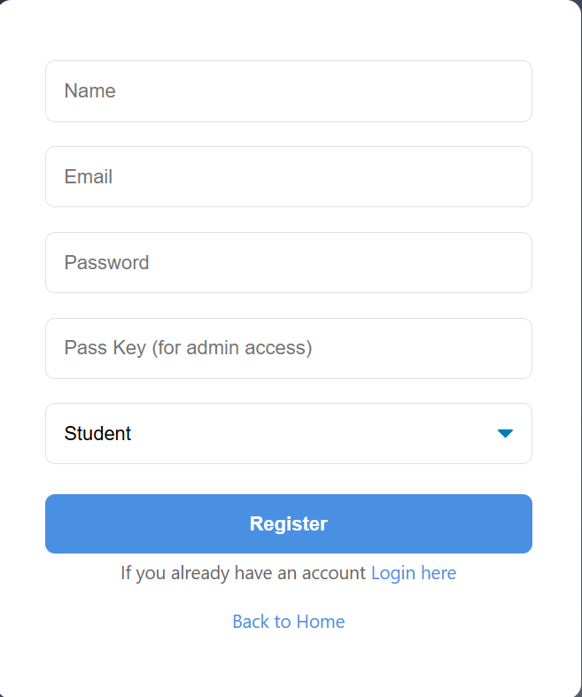

# 🎓 Certify Learn - Interactive Learning Management System (LMS)

> **Note:** The source code for this project is kept private to maintain academic integrity and system security. This repository serves as a technical showcase of the system architecture, UI/UX design, and development process.

---

### 📝 Project Overview
**Timeline:** Dec 2024 – May 2025 | **Associated with:** University of Moratuwa 
**Grade Awarded:** A+

Certify Learn is an e-learning portal engineered to integrate traditional learning with modern internet accessibility, providing an affordable and rational platform for students. Collaborated within a 3-person engineering team to design, document, and execute this fully functional LMS.

---

### 🎥 System Workflow Demonstration
Click the image below to watch a full video walkthrough of the LMS in action:

---

### 👨‍💻 My Role & Contributions
- Spearheaded the system presentation structure, video demonstrations, and comprehensive technical documentation (including UML and ER diagrams).
- Effectively bridged the gap between backend database development and user-facing frontend communication.
- Collaborated cross-functionally on system logic, relational database design, and end-to-end testing.

---

### ✨ Key System Features
- **Role-Based Architecture:** Developed distinct environments for public users, registered students, and administrators. Secure registration includes a custom passkey authentication system for admin access provisioning.
- **Student Portal & Assessments:** Engineered a seamless student journey featuring dynamic welcome dashboards, a simulated payment gateway with data validation, and sequential MCQ exams. 
- **Automated Certification:** Implemented a system that requires a 70% passing threshold to trigger dynamic, personalized PDF certificate generation.
- **Admin Dashboard & Content Management:** Built CRUD functionality for course and quiz management, alongside a dynamic review moderation system allowing admins to approve, reject, and filter student feedback before it updates the public landing page.

---

### 📐 System Architecture & Design
To ensure scalability and a seamless user experience, we mapped the system using comprehensive UML and database modeling.
*You can view the full technical documentation and diagrams in the [System Analysis & Design Report](./assets/Certify%20Learn%20Project%20Documentation.pdf).*

- **Database Design:** Structured a highly relational MySQL database utilizing an Entity Relationship model connecting Users, Courses, Exams, Quizzes, Certificates, and Reviews.
- **Process Flow:** Mapped complex user journeys (e.g., Course Purchasing, Quiz Management, and Admin workflows) using detailed Activity and Sequence diagrams.
- **System Boundaries:** Outlined strict access controls separating Guest, User, and Admin privileges through detailed Use Case mapping.

---

### 💻 UI/UX Implementation
*(Screenshots of the live production system)*

<b>1. Public Landing Page & Student Dashboard</b>

 
A modern, dark-themed welcome dashboard designed to encourage users to explore available learning materials.

<b>2. Secure Authentication & Role Selection</b>

 
A streamlined registration portal featuring dynamic dropdowns for user roles and hidden passkeys for elevated permissions.

<b>3. Dynamic Review Moderation (Admin)</b>

 
A comprehensive admin table for filtering student reviews by status (Pending, Approved, Rejected) to maintain platform quality.

<b>4. Automated Certificate Generation</b>

 
Dynamically rendered completion certificates generated upon passing sequential course exams.

---

### 🛠️ Tech Stack 
 

 &nbsp;&nbsp;&nbsp;&nbsp;
 &nbsp;&nbsp;&nbsp;&nbsp;
 &nbsp;&nbsp;&nbsp;&nbsp;
 &nbsp;&nbsp;&nbsp;&nbsp;

---

### 📫 Let's Connect
**Kavindu Herath** - [Connect with me on LinkedIn](https://www.linkedin.com/in/kavindu-d-herath)
